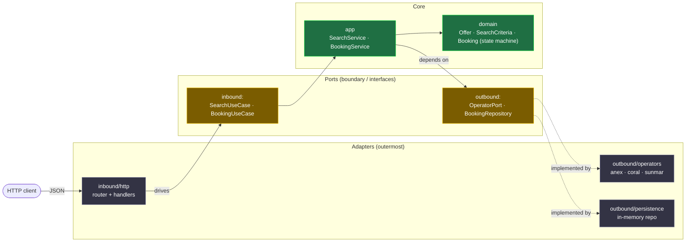

# booking-aggregator

A Go service that aggregates tour-operator offers behind a strict Ports & Adapters (Hexagonal) architecture — concurrent fan-out to operators, graceful degradation on slow/failing ones, and an explicit booking state machine with a pre-booking reconciliation step.

## Background

This is a compact, self-contained demo I built to showcase clean architecture and Go concurrency. It's modeled on a real system I worked on: an auto-booking service that aggregated offers from multiple tour operators, where each operator was integrated as a separate adapter and requests were fanned out concurrently with per-operator timeouts and graceful degradation. This repo distills that design into a small, reviewable codebase — the point is the design, not the size.

---

## Architecture

Dependencies point **inward**. The domain knows nothing about HTTP, operators, or storage; everything external plugs in through ports. `main.go` is the only place that knows the concrete adapters and wires them together — adding an operator is one new adapter, and the core never changes.



The rule that makes it Hexagonal: `domain` imports nothing internal · `app` imports `domain` + `ports` only · `adapters` implement `ports` · `cmd/api/main.go` wires the concrete adapters.

```
cmd/api/main.go            # composition root — the only place that knows concrete adapters
internal/
  domain/                  # Offer, SearchCriteria, Booking (state machine), errors — pure
  ports/                   # inbound + outbound interfaces (the hexagon boundary)
  app/                     # SearchService (fan-out) + BookingService (reconcile → book)
  adapters/
    inbound/http/          # REST handlers → inbound ports
    outbound/operators/    # anex, coral, sunmar (configurable mock) → OperatorPort
    outbound/persistence/  # in-memory BookingRepository
```

---

## Design decisions & trade-offs

- **Why an adapter per operator (Hexagonal).** In the real system, every operator had its own API shape, auth, and quirks — and new operators were added over time. Modelling each as a separate adapter behind one `OperatorPort` keeps those integration details out of the core: business rules live in `domain`/`app` and depend only on interfaces, never on HTTP, a framework, or an operator SDK. Adding an operator is one file implementing `OperatorPort`, registered in `main.go`; the core doesn't change, and each operator can be tested in isolation. The cost is more indirection and boilerplate (DTO mapping at the HTTP edge, explicit ports) — worth it for a system whose whole point is swappable integrations.

- **Why bounded concurrent fan-out.** Operators are independent network calls with very different latencies, so `SearchService` queries them in parallel with `golang.org/x/sync/errgroup` and `SetLimit(n)`. Bounding concurrency avoids unbounded goroutine growth and respects upstream rate limits (real operators throttle), while still overlapping the slow calls. An overall `context.WithTimeout` caps the total latency budget so the endpoint's tail latency is predictable rather than hostage to the slowest operator.

- **Why graceful degradation instead of fail-fast (availability > completeness).** In production one operator being slow or down is routine — it must **not** take down search for all the others. Each goroutine logs the failure and returns *no* results for that operator instead of propagating the error, so `errgroup`'s fail-fast cancellation deliberately never fires. The caller gets the offers that arrived within the budget; a flaky operator degrades the result set, it doesn't break the request. The trade-off is silent partial results — mitigated by logging every drop (and easily extendable to a per-operator status in the response).

- **Why an explicit booking state machine + reconciliation.** `Booking` is an aggregate whose state (`pending → confirmed | failed`) only changes through `Confirm`/`Fail`, which enforce a transition table — illegal moves return `ErrInvalidTransition` and leave state untouched. Before confirming, `BookingService` runs a **pre-booking reconciliation**: it re-validates availability and price with the operator, and a mismatch produces a *persisted failed booking* (retrievable by id) rather than silently booking at a stale price. Correctness of the money path over convenience.

- **Why an in-memory repository (swappable for Postgres).** The default `BookingRepository` is an in-memory, mutex-guarded store — zero infrastructure to run or demo, and it stores/returns copies so callers can't mutate persisted state through an aliased pointer. Because the app depends only on the `BookingRepository` port, swapping in a Postgres adapter is a `main.go` wiring change; no domain or app code moves. Persistence is a later, optional concern, not a prerequisite to running the service.

- **Injected clock & ID generator.** The domain and services take `now func() time.Time` (and the booking service a `newID func() string`) rather than calling `time.Now()`/generating IDs internally. Tests stay deterministic; `main.go` supplies `time.Now` and a `crypto/rand` id.

---

## Running

Requires Go 1.22+.

```bash
make run        # go run ./cmd/api  (listens on :8080, override with ADDR)
make test       # go test ./... -race
make lint       # golangci-lint run
```

Or with Docker:

```bash
docker compose up --build              # builds the multi-stage image, starts the API on :8080
HOST_PORT=8085 docker compose up --build   # if :8080 is taken, publish on another host port
```

Health check: `curl localhost:8080/healthz` → `{"status":"ok"}`.

---

## API

| Method | Path             | Purpose                                            |
|--------|------------------|----------------------------------------------------|
| `POST` | `/search`        | Fan out to operators, return aggregated offers     |
| `POST` | `/bookings`      | Reconcile + book a selected offer                  |
| `GET`  | `/bookings/{id}` | Fetch a booking's current state                    |
| `GET`  | `/healthz`       | Liveness probe                                      |

### Example: search

```bash
curl -s -X POST localhost:8080/search \
  -d '{"origin":"IST","destination":"AYT","departure_date":"2027-07-08T00:00:00Z","passengers":2}'
```

```json
{
  "offers": [
    {
      "id": "sunmar-1",
      "operator": "sunmar",
      "origin": "IST",
      "destination": "AYT",
      "departure_date": "2027-07-08T00:00:00Z",
      "passengers": 2,
      "price": { "amount_minor": 37900, "currency": "EUR", "display": "379.00 EUR" }
    },
    {
      "id": "anex-1",
      "operator": "anex",
      "origin": "IST",
      "destination": "AYT",
      "departure_date": "2027-07-08T00:00:00Z",
      "passengers": 2,
      "price": { "amount_minor": 39900, "currency": "EUR", "display": "399.00 EUR" }
    }
  ]
}
```

Offers are merged across operators and sorted by price ascending. If an operator is slow past the timeout or errors, it is dropped and the rest are still returned.

### Example: book a selected offer

```bash
curl -s -X POST localhost:8080/bookings \
  -d '{"offer":{"id":"anex-1","operator":"anex","origin":"IST","destination":"AYT","departure_date":"2027-07-08T00:00:00Z","passengers":2,"price":{"amount_minor":39900,"currency":"EUR"}},"passengers":2}'
```

`201 Created`, `Location: /bookings/bk_4540cb75aca8d695`:

```json
{
  "id": "bk_4540cb75aca8d695",
  "status": "confirmed",
  "offer": {
    "id": "anex-1",
    "operator": "anex",
    "origin": "IST",
    "destination": "AYT",
    "departure_date": "2027-07-08T00:00:00Z",
    "passengers": 2,
    "price": { "amount_minor": 39900, "currency": "EUR", "display": "399.00 EUR" }
  },
  "passengers": 2,
  "confirmation_ref": "ANEX-984059",
  "created_at": "2026-07-06T18:03:09Z",
  "updated_at": "2026-07-06T18:03:09Z"
}
```

If reconciliation finds the price changed or the offer gone, the booking is still created and persisted with `"status": "failed"` and a `failure_reason` — retrievable via `GET /bookings/{id}`. Business failures are recorded outcomes, not HTTP errors.
